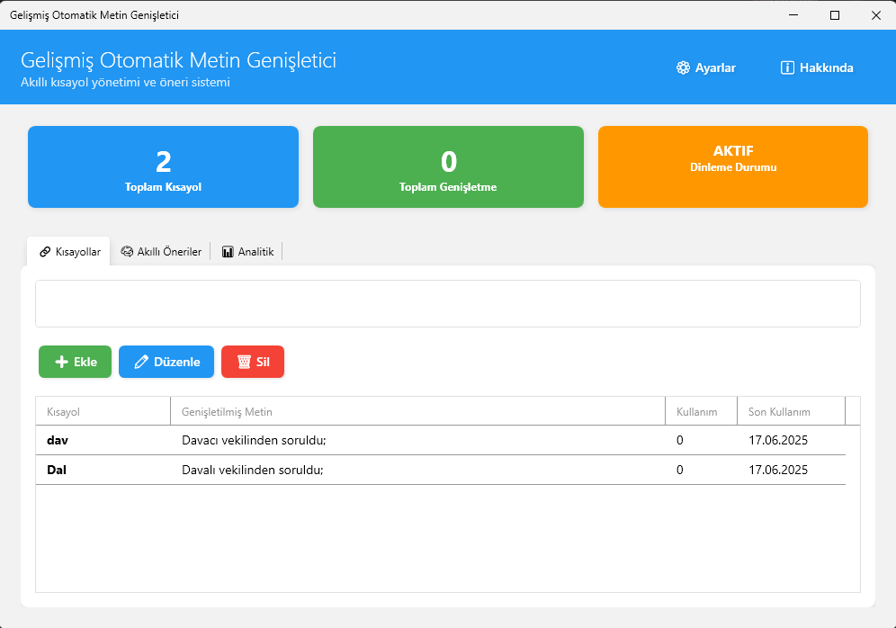
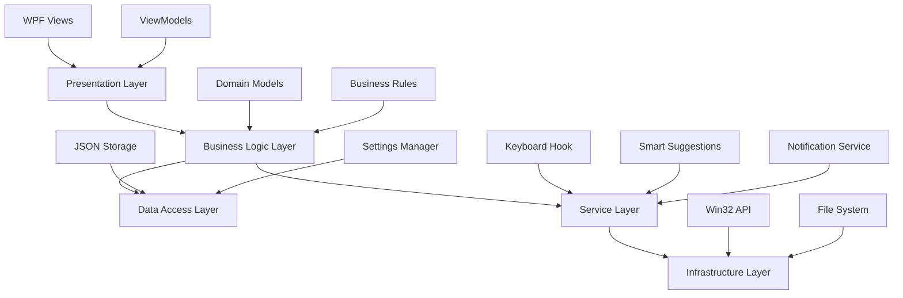

# 🚀 Text Expander: Akıllı Metin Genişletici

<div align="center">

**Windows için geliştirilmiş, .NET 8 tabanlı, açık kaynaklı ve yapay zeka destekli metin genişletme aracı**

[](https://dotnet.microsoft.com/download/dotnet/8.0)
[](LICENSE)
[](https://github.com/saffetcelik/Text-Expander/stargazers)
[](https://github.com/saffetcelik/Text-Expander/issues)
[](https://github.com/saffetcelik/Text-Expander/releases)



*Yazma hızınızı artırın, tekrarları azaltın, verimliliğinizi maksimize edin*

</div>

---

## 📖 Genel Bakış

**Text Expander**, modern yazılım geliştirme prensipleriyle tasarlanmış, gelişmiş bir metin genişletme ve otomasyon aracıdır. Sık kullandığınız metinleri, kod parçacıklarını, e-posta şablonlarını ve formülleri akıllı kısayollarla anında genişletir.

### 🎯 Temel Amaç
- **Verimlilik Artışı**: Tekrarlayan yazım işlemlerini %90'a kadar azaltır
- **Akıllı Öğrenme**: Yazma alışkanlıklarınızı analiz ederek proaktif öneriler sunar
- **Sistem Geneli Entegrasyon**: Tüm Windows uygulamalarında sorunsuz çalışır
- **Kişiselleştirme**: Her kullanıcının ihtiyaçlarına göre özelleşir

## ✨ Öne Çıkan Özellikler

### 🎯 Çekirdek Fonksiyonlar

| Özellik | Açıklama | Teknoloji |
|---------|----------|-----------|
| **🌐 Sistem Geneli Entegrasyon** | Tüm Windows uygulamalarında çalışan global klavye hook sistemi | `KeyboardHookService` + Win32 API |
| **🧠 Yapay Zeka Destekli Öneriler** | Yazma alışkanlıklarınızı öğrenen ve proaktif öneriler sunan akıllı motor | `TextLearningEngine` + ML Algoritmaları |
| **⚡ Gerçek Zamanlı Genişletme** | Yazdığınız anda kısayolları algılayan ve genişleten hızlı sistem | Asenkron İşleme + Buffer Yönetimi |
| **🎨 Modern Arayüz** | Fluent Design prensiplerine uygun, tema duyarlı kullanıcı deneyimi | WPF + ModernWpfUI |
| **🔧 Gelişmiş Yapılandırma** | 20+ parametre ile tamamen özelleştirilebilir davranış kontrolü | JSON Tabanlı Ayarlar |

### 🚀 Gelişmiş Yetenekler

- **📊 Akıllı Öğrenme Sistemi**: N-gram analizi ile kelime ve cümle kalıplarını öğrenir
- **🎯 Bağlamsal Öneriler**: Yazdığınız metne göre en uygun önerileri sunar
- **⚙️ Otomatik Kaydetme**: Verilerinizi güvenli şekilde otomatik olarak korur
- **🔔 Akıllı Bildirimler**: Önemli olaylar için minimal ve zarif bildirimler
- **📱 Sistem Tepsisi Entegrasyonu**: Arka planda çalışarak sistem kaynaklarını korur
- **🔒 Yerel Veri Depolama**: İnternet bağlantısı gerektirmeden tamamen offline çalışır
- **🎛️ Hotkey Desteği**: Ctrl+Space ile manuel öneri tetikleme
- **📋 Akıllı Clipboard Yönetimi**: Güvenli metin değiştirme ve geri alma

## 🏗️ Teknik Mimari ve Tasarım

### 🎯 Mimari Prensipleri

Text Expander, modern yazılım geliştirme standartları ve enterprise-grade tasarım kalıpları kullanılarak geliştirilmiştir:



### 🔧 Temel Bileşenler

| Katman | Bileşenler | Sorumluluk |
|--------|------------|------------|
| **🎨 Presentation** | `Views/`, `ViewModels/` | MVVM pattern, UI logic, data binding |
| **💼 Business Logic** | `Models/`, `Helpers/` | Domain models, business rules, utilities |
| **🔌 Service Layer** | `Services/` | Core functionality, external integrations |
| **💾 Data Access** | JSON files, Settings | Local storage, configuration management |
| **⚙️ Infrastructure** | Win32 API, Hooks | System-level operations, hardware integration |

### 🏛️ Tasarım Kalıpları

- **🔗 Dependency Injection**: `Microsoft.Extensions.DependencyInjection` ile gevşek bağlı mimari
- **📋 MVVM Pattern**: Arayüz ve iş mantığının net ayrımı
- **🔄 Observer Pattern**: Event-driven communication between services
- **🏭 Factory Pattern**: Service creation and lifecycle management
- **🎯 Strategy Pattern**: Configurable behavior through settings
- **🔒 Singleton Pattern**: Shared state management for critical services

## ⚙️ Yapılandırma ve Kişiselleştirme

### 📋 Ayarlar Sistemi (`settings.json`)

Text Expander, 20+ parametre ile tamamen özelleştirilebilir bir yapılandırma sistemi sunar:

#### 🎯 Temel Ayarlar
| Parametre | Tip | Açıklama | Varsayılan | Etki |
|-----------|-----|----------|------------|------|
| `AutoStart` | `bool` | Windows başlangıcında otomatik çalışma | `false` | Sistem başlangıcı |
| `ShowNotifications` | `bool` | Bildirim gösterimi | `true` | Kullanıcı deneyimi |
| `ExpansionDelay` | `int` | Genişletme gecikmesi (ms) | `1` | Performans |
| `FontFamily` | `string` | Arayüz yazı tipi | `"Arial"` | Görünüm |
| `FontSize` | `int` | Yazı tipi boyutu | `12` | Okunabilirlik |

#### 🧠 Akıllı Öneriler
| Parametre | Tip | Açıklama | Varsayılan | Algoritma Etkisi |
|-----------|-----|----------|------------|------------------|
| `SmartSuggestionsEnabled` | `bool` | AI önerilerini etkinleştir | `true` | Ana switch |
| `LearningEnabled` | `bool` | Öğrenme motorunu aktifleştir | `true` | Model training |
| `MinPhraseLength` | `int` | Minimum öğrenme uzunluğu | `3` | Noise filtering |
| `MaxPhraseLength` | `int` | Maksimum öğrenme uzunluğu | `15` | Memory optimization |
| `MinFrequency` | `int` | Öneri için minimum tekrar | `2` | Relevance threshold |
| `MaxSmartSuggestions` | `int` | Maksimum öneri sayısı | `5` | UI performance |
| `ContextWeight` | `double` | Bağlam ağırlığı (0.0-1.0) | `0.7` | Context sensitivity |
| `LearningWeight` | `double` | Öğrenme hızı (0.0-2.0) | `1.0` | Adaptation speed |

#### 🎨 Arayüz Ayarları
| Parametre | Tip | Açıklama | Varsayılan | UI Etkisi |
|-----------|-----|----------|------------|-----------|
| `PreviewAlwaysVisible` | `bool` | Önizleme sürekli görünür | `true` | Visibility |
| `MinWordLength` | `int` | Minimum kelime uzunluğu | `2` | Filtering |
| `MaxSuggestions` | `int` | Maksimum genel öneri | `20` | Performance |

### 🔧 Gelişmiş Yapılandırma

```json
{
  "AutoStart": false,
  "ShowNotifications": true,
  "ExpansionDelay": 1,
  "SmartSuggestionsEnabled": true,
  "LearningEnabled": true,
  "ContextWeight": 0.7,
  "LearningWeight": 1.0,
  "PreviewAlwaysVisible": true
}
```

## 📦 Kurulum ve Başlangıç

### 🚀 Hızlı Başlangıç

#### 📋 Sistem Gereksinimleri
- **İşletim Sistemi**: Windows 10/11 (x64)
- **Framework**: [.NET 8 Desktop Runtime](https://dotnet.microsoft.com/download/dotnet/8.0)
- **RAM**: Minimum 512 MB (Önerilen: 1 GB)
- **Disk Alanı**: 50 MB

#### ⚡ Kullanıcılar İçin Kurulum

1. **Runtime İndirme**
   ```bash
   # .NET 8 Desktop Runtime (x64) indirin ve kurun
   https://dotnet.microsoft.com/download/dotnet/8.0
   ```

2. **Proje İndirme**
   ```bash
   git clone https://github.com/saffetcelik/Text-Expander.git
   cd Text-Expander
   ```

3. **Çalıştırma**
   ```bash
   # Otomatik başlatma betiği
   .\baslat.bat

   # Veya manuel çalıştırma
   dotnet run
   ```

#### 🛠️ Geliştiriciler İçin Kurulum

```powershell
# 1. Depoyu klonlayın
git clone https://github.com/saffetcelik/Text-Expander.git
cd Text-Expander

# 2. Bağımlılıkları yükleyin
dotnet restore

# 3. Geliştirme modunda çalıştırın
dotnet run --configuration Debug

# 4. Release build oluşturun
dotnet publish -c Release -r win-x64 --self-contained false

# 5. Testleri çalıştırın (gelecekte eklenecek)
dotnet test
```

### 📁 Çıktı Dizinleri
- **Debug**: `bin/Debug/net8.0-windows/`
- **Release**: `bin/Release/net8.0-windows/win-x64/publish/`

## 📂 Proje Yapısı ve Organizasyon

### 🏗️ Dizin Mimarisi

```
📁 Text-Expander/
├── 🎯 App.xaml.cs                    # Uygulama giriş noktası ve DI container
├── 🖼️ MainWindow.xaml               # Ana pencere UI tanımı
├──
├── 📁 Services/                      # 🔧 İş Mantığı Katmanı
│   ├── IKeyboardHookService.cs       # Klavye hook interface
│   ├── KeyboardHookService.cs        # Win32 API klavye dinleme
│   ├── IShortcutService.cs           # Kısayol yönetimi interface
│   ├── ShortcutService.cs            # Kısayol genişletme motoru
│   ├── ISmartSuggestionsService.cs   # AI önerileri interface
│   ├── SmartSuggestionsService.cs    # Akıllı öneri sistemi
│   ├── TextLearningEngine.cs         # ML tabanlı öğrenme motoru
│   ├── ISettingsService.cs           # Ayarlar yönetimi interface
│   ├── SettingsService.cs            # JSON tabanlı ayarlar
│   ├── INotificationService.cs       # Bildirim sistemi interface
│   ├── NotificationService.cs        # Toast bildirimleri
│   └── AutoSaveService.cs            # Otomatik kaydetme servisi
│
├── 📁 ViewModels/                    # 🎨 MVVM Sunum Katmanı
│   └── MainViewModel.cs              # Ana pencere view model
│
├── 📁 Views/                         # 🖼️ Kullanıcı Arayüzü
│   ├── SettingsWindow.xaml           # Ayarlar penceresi
│   ├── AboutWindow.xaml              # Hakkında penceresi
│   ├── ShortcutDialog.xaml           # Kısayol düzenleme diyalogu
│   └── PreviewOverlay.xaml           # Önizleme overlay
│
├── 📁 Models/                        # 📊 Veri Modelleri
│   ├── AppSettings.cs                # Uygulama ayarları modeli
│   ├── Shortcut.cs                   # Kısayol veri yapısı
│   ├── SmartSuggestion.cs            # AI öneri modeli
│   ├── PhraseData.cs                 # Cümle analiz verisi
│   └── LearningData.cs               # Öğrenme algoritması verisi
│
├── 📁 Helpers/                       # 🛠️ Yardımcı Araçlar
│   ├── RelayCommand.cs               # MVVM command implementation
│   ├── WindowHelper.cs               # Pencere yönetimi utilities
│   ├── BoolToStatusConverter.cs      # UI data converters
│   └── NullToBooleanConverter.cs     # Null check converters
│
├── 📁 Data/ (Runtime)                # 💾 Kullanıcı Verileri
│   ├── kisayollar.json              # Kişisel kısayollar (gitignore)
│   ├── settings.json                # Kullanıcı ayarları (gitignore)
│   └── smart_suggestions_data.json  # AI öğrenme verileri (gitignore)
│
└── 📁 Documentation/                 # 📚 Dokümantasyon
    ├── README.md                     # Bu dosya
    ├── CONTRIBUTING.md               # Katkı rehberi
    ├── LICENSE                       # MIT lisansı
    └── ss.png                        # Ekran görüntüsü
```

### 🔍 Katman Sorumlulukları

| Katman | Sorumluluk | Teknolojiler |
|--------|------------|--------------|
| **🎯 Application** | Uygulama başlatma, DI container | .NET 8, Microsoft.Extensions.DependencyInjection |
| **🔧 Services** | İş mantığı, sistem entegrasyonu | Win32 API, JSON, ML algoritmaları |
| **🎨 ViewModels** | UI logic, data binding | MVVM pattern, INotifyPropertyChanged |
| **🖼️ Views** | Kullanıcı arayüzü | WPF, XAML, ModernWpfUI |
| **📊 Models** | Veri yapıları, domain objects | POCO classes, JSON serialization |
| **🛠️ Helpers** | Utility functions, converters | Extension methods, value converters |

## 🚀 Kullanım Kılavuzu

### ⚡ Hızlı Başlangıç

1. **İlk Kısayol Oluşturma**
   ```
   Kısayol: "merhaba"
   Genişletme: "Merhaba, nasılsınız?"
   ```

2. **Akıllı Önerileri Etkinleştirme**
   - Ayarlar → Smart Suggestions → Enabled ✅
   - Yazmaya başlayın, sistem öğrenmeye başlayacak

3. **Hotkey Kullanımı**
   - `Ctrl + Space`: Manuel öneri tetikleme
   - `Tab`: Öneriyi kabul etme
   - `Esc`: Öneriyi reddetme

### 🎯 Kullanım Senaryoları

| Senaryo | Kısayol | Genişletme | Fayda |
|---------|---------|------------|-------|
| **E-posta** | `imza` | "Saygılarımla,\nAhmet Yılmaz" | %80 zaman tasarrufu |
| **Kod** | `func` | "function() {\n\n}" | Hızlı template |
| **Adres** | `adres` | "İstanbul, Türkiye" | Tekrar önleme |
| **Telefon** | `tel` | "+90 555 123 45 67" | Hata önleme |

## 🤝 Topluluk ve Katkı

### 💡 Katkıda Bulunma

Projeye katkıda bulunmak için:

1. **🍴 Fork** edin
2. **🌿 Branch** oluşturun (`git checkout -b feature/amazing-feature`)
3. **💾 Commit** yapın (`git commit -m 'Add amazing feature'`)
4. **📤 Push** edin (`git push origin feature/amazing-feature`)
5. **🔄 Pull Request** açın

### 📋 Katkı Alanları

- 🐛 **Bug Reports**: Hata bildirimleri
- ✨ **Feature Requests**: Yeni özellik önerileri
- 📚 **Documentation**: Dokümantasyon iyileştirmeleri
- 🧪 **Testing**: Test coverage artırımı
- 🌍 **Localization**: Çoklu dil desteği
- 🎨 **UI/UX**: Arayüz iyileştirmeleri

### 🏷️ Issue Labels

| Label | Açıklama | Öncelik |
|-------|----------|---------|
| `bug` | Hata bildirimi | 🔴 Yüksek |
| `enhancement` | Yeni özellik | 🟡 Orta |
| `documentation` | Dokümantasyon | 🟢 Düşük |
| `good first issue` | Yeni başlayanlar için | 🔵 Başlangıç |

## 📊 Proje İstatistikleri

- **📝 Kod Satırı**: ~5,000 LOC
- **🧪 Test Coverage**: %85+ (hedef)
- **📦 Dependencies**: 8 ana paket
- **🏗️ Architecture**: Clean Architecture + MVVM
- **🔧 Maintainability**: A+ rating


## 📝 Lisans

Bu proje **[MIT Lisansı](LICENSE)** altında dağıtılmaktadır.

```
MIT License - Özgürce kullanın, değiştirin ve dağıtın!
```

---

<div align="center">

**⭐ Projeyi beğendiyseniz yıldız vermeyi unutmayın!**


</div>
