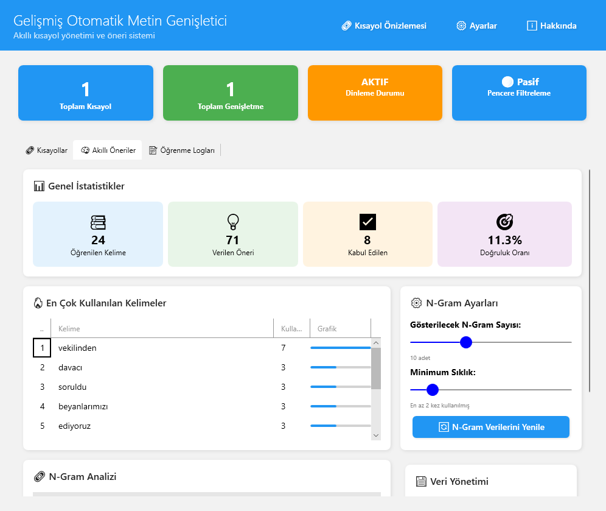

# Text Expander: Akıllı Metin Genişletici

<p align="center">
  <b>Windows için geliştirilmiş, .NET 8 tabanlı, açık kaynaklı ve akıllı bir metin genişletme aracı.</b>
  <br><br>
  
  
  
</p>

<p align="center">
  
</p>

**Text Expander**, sık kullandığınız metinleri, kod parçacıklarını veya formülleri sizin için hatırlayan ve belirlediğiniz kısaltmalarla anında yapıştıran modern bir verimlilik aracıdır. Sistem genelinde çalışan klavye dinleme servisleri sayesinde, herhangi bir uygulamada yazarken kısayollarınızı otomatik olarak genişletir.

## ✨ Temel Özellikler

- **Sistem Geneli Kısayol Genişletme**: `KeyboardHookService` kullanarak klavye girdilerini global olarak dinler ve tanımlı kısayolları anında genişletir.
- **Akıllı Öneri Motoru (`SmartSuggestionsService`)**: `TextLearningEngine` modülü ile yazma alışkanlıklarınızı analiz eder. Tekrar eden kalıpları öğrenerek size proaktif olarak yeni kısayol önerileri sunar.
- **Esnek ve Güçlü Yapılandırma**: Tüm davranışlar, `settings.json` dosyası üzerinden kontrol edilebilir. Gecikme sürelerinden öğrenme motoru ağırlıklarına kadar her detayı özelleştirin.
- **Modern Arayüz (WPF & ModernWpfUI)**: .NET 8 ve Fluent Design prensipleriyle geliştirilmiş, sistem temasına (karanlık/aydınlık) duyarlı, akıcı ve sezgisel bir kullanıcı arayüzü.
- **Arka Plan Çalışması ve Sistem Tepsisi**: `Hardcodet.NotifyIcon.Wpf` entegrasyonu ile uygulama, sistem kaynaklarını minimum düzeyde kullanarak arka planda çalışır ve sistem tepsisinden kolayca yönetilir.
- **Veri Yönetimi**: Tüm kısayollar ve öğrenme verileri, `kisayollar.json` ve `smart_suggestions_data.json` dosyalarında yerel olarak saklanır. Harici bir veritabanı veya internet bağlantısı gerektirmez.

## 🛠️ Teknik Mimarisi

Uygulama, modern .NET prensipleri üzerine inşa edilmiştir:

- **Dependency Injection (DI)**: Servisler (`ISettingsService`, `IShortcutService` vb.) ve ViewModel'ler, başlangıçta `App.xaml.cs` içinde bir `ServiceProvider` aracılığıyla yönetilir. Bu, gevşek bağlı (loosely-coupled) ve test edilebilir bir kod tabanı sağlar.
- **MVVM (Model-View-ViewModel)**: Arayüz (`Views`), iş mantığı (`ViewModels`) ve veri (`Models`) katmanları birbirinden net bir şekilde ayrılmıştır.
- **Arka Plan Servisleri**: `KeyboardListenerService` gibi servisler, ana UI thread'ini meşgul etmeden arka planda çalışarak sistem performansını korur.

## ⚙️ Yapılandırma (`settings.json`)

Uygulamanın tüm davranışları `settings.json` dosyası üzerinden detaylı bir şekilde kontrol edilebilir:

| Anahtar | Veri Tipi | Açıklama | Varsayılan |
|--------------------------|----------|--------------------------------------------------------------------------------|-------------|
| `AutoStart` | `bool` | Windows başlangıcında otomatik olarak çalışır. | `false` |
| `ShowNotifications` | `bool` | Genişletme veya hatalar için bildirim gösterir. | `true` |
| `ExpansionDelay` | `int` | Genişletme öncesi beklenecek milisaniye. | `1` |
| `FontFamily` | `string` | Uygulama içi yazı tipi. | `"Arial"` |
| `FontSize` | `int` | Uygulama içi yazı tipi boyutu. | `12` |
| `SmartSuggestionsEnabled`| `bool` | Akıllı öneri motorunu etkinleştirir. | `true` |
| `LearningEnabled` | `bool` | `TextLearningEngine`'in yeni kalıplar öğrenmesini sağlar. | `true` |
| `MinPhraseLength` | `int` | Öğrenme için gereken minimum karakter sayısı. | `3` |
| `MaxPhraseLength` | `int` | Öğrenme için gereken maksimum karakter sayısı. | `15` |
| `MinFrequency` | `int` | Bir metnin öneri olması için gereken minimum tekrar sayısı. | `2` |
| `MaxSmartSuggestions` | `int` | Gösterilecek maksimum akıllı öneri sayısı. | `5` |
| `ContextWeight` | `double` | Öneri puanlamasında bağlamın (önceki kelimeler) ağırlığı. | `0.7` |
| `LearningWeight` | `double` | Öğrenme motorunun yeni kalıplara verdiği önem. | `1.0` |

## 📦 Kurulum ve Çalıştırma

1.  **Gereksinimler**: [.NET 8 Desktop Runtime (x64)](https://dotnet.microsoft.com/en-us/download/dotnet/8.0) yüklü olmalıdır.
2.  **Klonlama**: Projeyi yerel makinenize klonlayın:
    ```bash
    git clone https://github.com/saffetcelik/Text-Expander.git
    cd Text-Expander
    ```
3.  **Çalıştırma**: `baslat.bat` betiğini çalıştırarak uygulamayı başlatın. Bu betik, gerekli bağımlılıkları kontrol eder ve uygulamayı çalıştırır.

### Geliştiriciler İçin Derleme

Projeyi kendiniz derlemek isterseniz, .NET 8 SDK yüklü bir ortamda aşağıdaki komutu çalıştırın:

```powershell
# Bağımlılıkları geri yükle
dotnet restore

# Yayınlanabilir (Release) bir sürüm oluştur
dotnet publish -c Release -r win-x64 --self-contained false
```

Çıktı `bin/Release/net8.0-windows/win-x64/publish/` dizininde oluşturulacaktır.

## 📂 Proje Yapısı

```
/Text-Expander
├── Services/         # Çekirdek iş mantığı (klavye dinleme, ayarlar, öneriler)
├── ViewModels/       # Arayüz mantığı ve veri bağlama (MVVM)
├── Views/            # WPF pencereleri ve kullanıcı kontrolleri (XAML)
├── Models/           # Veri yapıları (Shortcut, Settings, vb.)
├── Helpers/          # Yardımcı sınıflar ve uzantılar
├── kisayollar.json   # Kullanıcı tarafından tanımlanan kısayollar
├── settings.json     # Uygulama yapılandırma ayarları
└── OtomatikMetinGenisletici.sln
```

## 🤝 Katkıda Bulunma

Katkılarınız projeyi daha iyi hale getirecektir! Lütfen `CONTRIBUTING.md` dosyasını okuyarak katkı kurallarını ve sürecini öğrenin. Hata bildirimleri ve özellik istekleri için **Issues** bölümünü kullanmaktan çekinmeyin.

## 📝 Lisans

Bu proje [MIT Lisansı](LICENSE) altında dağıtılmaktadır.
